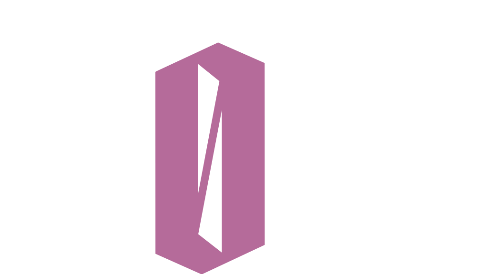

<div align="center">



# Banda 4zero4!

***Website oficial desenvolvido pela Lucas Code***

[]()&nbsp;
[]()&nbsp;
[](./LICENSE)


</div>

<p align="center">
  <a href="#projeto">Projeto</a>&nbsp;&nbsp;&nbsp;|&nbsp;&nbsp;&nbsp;
  <a href="#funcionalidades">Funcionalidades</a>&nbsp;&nbsp;&nbsp;|&nbsp;&nbsp;&nbsp;
  <a href="#tecnologias">Tecnologias</a>&nbsp;&nbsp;&nbsp;|&nbsp;&nbsp;&nbsp;
  <a href="#estrutura">Estrutura</a>
</p>

## PROJETO

Website oficial da banda **4zero4!**, desenvolvido em formato One Page para centralizar informações, apresentar conteúdos da banda e fortalecer sua presença digital.

O projeto foi completamente refatorado antes do lançamento final, com foco em uma experiência visual imersiva, organização do código, responsividade, acessibilidade, performance e SEO técnico.

A implementação também contempla recursos como galeria de fotos, apresentação dos integrantes, discografia, agenda de shows e formulário de contato integrado.

🌐 [Acesse o website](https://4zero4.vercel.app/)

## FUNCIONALIDADES

- **Experiência imersiva** — vídeo de fundo otimizado e animações de entrada acionadas com `IntersectionObserver`
- **Apresentação da banda** — seções personalizada para apresentação da banda com imagem flutuante otimizada
- **Cards interativos** — apresentação dos integrantes, canais de contato, discografia e agenda de shows
- **Galeria de fotos** — transição em fade com navegação por clique e teclado
- **Formulário de contato** — formulário funcional integrado ao Formspree
- **Acessibilidade** — navegação por teclado, atributos ARIA e estrutura semântica
- **Layout responsivo** — adaptação da interface para diferentes dispositivos e tamanhos de tela
- **Microinterações** — animações e estados visuais para enriquecer a experiência de navegação

## TECNOLOGIAS

| Tecnologia | Uso |
|---|---|
| HTML5 | Estrutura semântica, acessível e otimizada para SEO com JSON-LD |
| CSS3 | Estilos, variáveis globais, CSS Nesting e animações |
| JavaScript ES6+ | Implementação das interações da interface |
| Formspree | Integração do formulário de contato |
| Git/Github | Versionamento de código |
| Vercel | Hospedagem e publicação do projeto |

## ESTRUTURA

```
📁 4zero4
├── 📁 docs
│   ├── 📂 assets
│   │   ├── 📁 docs            → Arquivo do Press Kit
│   │   ├── 📁 fonts           → Fontes
│   │   ├── 📁 img             → Imagens organizadas por seção
│   │   └── 📁 videos          → Vídeos
│   ├── 📂 src
│   │   ├── 📂 css
│   │   │   └── style.css       → Código CSS para estilização do projeto
│   │   └── 📂 js
│   │       ├── form.js         → Código JS para funcionalidade do formulário
│   │       ├── gallery.js      → Código JS para funcionalidade da galeria de fotos
│   │       ├── menu.js         → Código JS para funcionalidade do menu e header
│   │       └── reveal.js       → Código JS para funcionalidade do reveal do conteúdo
│   ├── 📁 dist
│   │   ├── 📂 css
│   │   │   └── style.min.css   → Código CSS minificado
│   │   └── 📂 js
│   │       ├── form.min.js     → Código JS para funcionalidade do formulário minificado
│   │       ├── gallery.min.js  → Código JS para funcionalidade da galeria de fotos minificado
│   │       ├── menu.min.js     → Código JS para funcionalidade do menu e header minificado
│   │       └── reveal.min.js   → Código JS para funcionalidade do reveal do conteúdo minificado
│   └── index.html              → Página principal
├── README.md                   
└── LICENSE                     
```

---

## LICENÇA

Este projeto é público exclusivamente para fins de portfólio do desenvolvedor.

O código, o design, os textos, as imagens, os vídeos e os demais recursos visuais relacionados à banda pertencem à **4zero4!**. A cópia, reprodução, distribuição ou utilização comercial de qualquer parte desses materiais depende de autorização expressa dos respectivos detentores dos direitos.

Veja o arquivo [LICENSE](./LICENSE) para mais detalhes.

## AUTOR    

**`</>` ᴅᴇᴠᴇʟᴏᴘᴇᴅ ʙʏ**

**ʟᴜᴄᴀꜱ ᴄᴏᴅᴇ // ᴡᴇʙ ᴅᴇᴠᴇʟᴏᴘᴍᴇɴᴛ ꜱᴛᴜᴅɪᴏ**  
[**ᴡᴇʙꜱɪᴛᴇ**](https://lvcascode.com.br) ▪ [**ɪɴꜱᴛᴀɢʀᴀᴍ**](https://instagram.com/lvcascode) ▪ [**ʟɪɴᴋᴇᴅɪɴ**](https://linkedin.com/in/lucascouto-dev)

